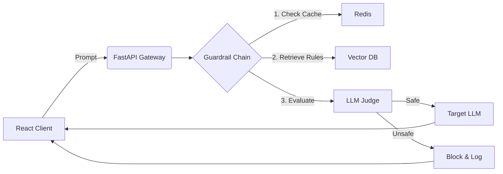

# 🛡️ Redacted: Dynamic RAG Security Gateway

**A Full-Stack AI Security Platform utilizing RAG to validate LLM inputs against organizational policies.**
> Keep your AI conversations ████████


---

## 🎯 Project Overview

Redacted is a **Semantic Firewall** for Large Language Models. Unlike traditional security tools that rely on static keywords (Regex), Redacted uses **RAG (Retrieval Augmented Generation)** to dynamically fetch security policies and validate user prompts against them in real-time.

**The Problem:** Static filters cannot understand context or evolving company policies.
**The Solution:** A dynamic guardrail system that "reads" the company's rulebook before approving any request.

### ✨ Key Features
* **Interactive Playground (React):** A dual-pane dashboard to test prompts and visualize the security decision process.
* **Dynamic Rule Retrieval:** Uses a Vector DB (Pinecone/Chroma) to find relevant security policies for each specific prompt.
* **Transparent Decision Logic:** Shows exactly which "documents" caused a block (Explainable AI).
* **AWS Ready:** Designed to run on AWS Lambda (Backend) and S3/CloudFront (Frontend).

---

## 🏗️ Architecture

### High-Level Flow
1. **Client (React):** User sends a prompt via the Dashboard.
2. **API (FastAPI):** Receives the request.
3. **Guardrail Chain (LangChain):**
   * **Step A:** Basic Regex Filter (SQL Injection, classic jailbreaks).
   * **Step B (RAG):** Queries the **Vector DB** for relevant policy documents based on the prompt.
   * **Step C (LLM Judge):** An LLM evaluates the prompt *given* the retrieved policies.
4. **Response:** The system returns either the safe answer OR a detailed rejection log to the frontend.



---

## 🛠️ Tech Stack

### Frontend (Client)
* **Framework:** React (Vite)
* **Styling:** Tailwind CSS (Dark Mode optimized)
* **State Management:** Zustand (Handling async analysis flows)
* **Visualization:** Framer Motion (for smooth transitions between checking steps)

### Backend (Server)
* **API:** FastAPI (Python)
* **Orchestration:** LangChain / LangGraph
* **Vector Database:** Pinecone (Production) / ChromaDB (Local dev)
* **LLM:** AWS Bedrock or OpenAI GPT-4o

### DevOps & Cloud
* **Compute:** AWS Lambda (Dockerized)
* **Deployment:** Docker + GitHub Actions

---

## 🚀 Getting Started

### Prerequisites
* Node.js v18+
* Python 3.10+
* Docker
* Pinecone API Key & OpenAI/AWS Key

### Installation

#### 1. Clone the repository
```bash
git clone <your-repo-url>
cd llm-security-gateway
```

#### 2. Setup Backend
```bash
cd backend
python -m venv venv
source venv/bin/activate  # On Windows: venv\Scripts\activate
pip install -r requirements.txt

# Ingest the policy documents into Vector DB
python scripts/ingest.py

# Start the API server
uvicorn app.main:app --reload
```

#### 3. Access the Application
* **Redacted (UI):** http://localhost:3000 – see [REDACTED.md](./REDACTED.md) to run
* **Backend API:** http://localhost:8000
* **API Docs:** http://localhost:8000/docs

### Redacted (Link management)

The project also includes **Redacted** – a link management platform (shortening, analytics, custom links). The frontend lives in the `redacted/` folder.

For detailed setup and run instructions, see **[REDACTED.md](./REDACTED.md)**. Quick start:

```bash
cd redacted
npm install
# Configure .env (Clerk, MongoDB) – see redacted/.env.example
npm run dev
```

→ **http://localhost:3000**

---

## 📂 Project Structure

```
llm-security-gateway/
│
├── backend/                   # Python FastAPI Application
│   ├── app/
│   │   ├── api/               # API Routes (Endpoints)
│   │   │   ├── endpoints/
│   │   │   │   └── analyze.py # Main endpoint for prompt analysis
│   │   │   └── router.py
│   │   │
│   │   ├── core/              # Config & Security
│   │   │   └── config.py
│   │   │
│   │   ├── chains/            # LangChain Logic (The Brain)
│   │   │   ├── guardrail.py   # The main RAG + Judge chain
│   │   │   └── prompts.py     # System prompts for the Judge LLM
│   │   │
│   │   ├── services/          # External Integrations
│   │   │   ├── vector_db.py   # Pinecone/Chroma logic
│   │   │   └── llm_provider.py# Wrapper for OpenAI/AWS Bedrock
│   │   │
│   │   └── main.py            # App entry point
│   │
│   ├── data/                  # Knowledge Base
│   │   ├── policies/          # PDF/TXT files (Company Rules)
│   │   └── attacks/           # Examples of known attacks
│   │
│   ├── scripts/
│   │   └── ingest.py          # Script to load 'data/' into Vector DB
│   │
│   ├── requirements.txt
│   └── Dockerfile             # For AWS Lambda deployment
│
├── infra/                     # Infrastructure as Code (Optional/Future)
│   └── aws/                   # Terraform or CDK files
│
├── redacted/                  # Redacted – Link management (Next.js)
│   ├── src/
│   ├── prisma/
│   └── package.json
│
├── docker-compose.yml         # Run everything locally
└── README.md
```

---

## 🔍 How It Works

### 1. User Submits a Prompt
The user types a question or request in the React frontend chat interface.

### 2. Basic Pattern Matching (Fast Filter)
Before anything expensive, the system checks for obvious red flags:
* SQL injection attempts
* Classic jailbreak phrases ("ignore previous instructions")
* Known malicious patterns

**Speed:** < 10ms

### 3. RAG Policy Retrieval
If the prompt passes the basic filter, the system:
1. Converts the prompt into a vector embedding
2. Searches the Vector DB for the most relevant policy documents
3. Retrieves the top 3-5 matching policies

**Example:** If the prompt is "Can I share customer emails with vendors?", the system retrieves the "Data Privacy Policy" and "Third-Party Sharing Guidelines".

### 4. LLM Judge Evaluation
An LLM (GPT-4 or Claude) is given:
* The original user prompt
* The retrieved policy documents
* A system prompt that says: "Evaluate if this request violates any of these policies"

The LLM returns:
```json
{
  "is_safe": false,
  "reason": "This violates Section 4.2 of the Data Privacy Policy",
  "confidence": 0.92
}
```

### 5. Response to User
**If Safe:** The prompt is forwarded to the target LLM (ChatGPT, Claude, etc.) and the response is returned.
**If Unsafe:** The user sees a detailed explanation of why the request was blocked, including the specific policy section violated.

---

## 📊 Example Use Cases

### Use Case 1: HR Policy Compliance
**Scenario:** Company chatbot that answers employee questions.

**Policy Documents in Vector DB:**
* HR_Manual.pdf
* Remote_Work_Policy.pdf
* Time_Off_Guidelines.pdf

**User Prompt:** "Can I take 6 weeks of vacation in a row?"

**System Response:**
* **RAG Retrieval:** Finds section 3.4 of Time_Off_Guidelines.pdf
* **LLM Judge:** "Maximum consecutive vacation is 3 weeks (Section 3.4)"
* **Output:** "No, company policy limits consecutive vacation to 3 weeks. You can split it into multiple periods."

---

### Use Case 2: Customer Data Protection
**Scenario:** Sales team chatbot with access to customer data.

**Policy Documents:**
* GDPR_Compliance.pdf
* Data_Retention_Policy.pdf
* Customer_Data_Usage.pdf

**User Prompt:** "Send me a list of all customers who bought Product X in 2022"

**System Response:**
* **RAG Retrieval:** Finds sections on "Bulk Data Export" and "Purpose Limitation"
* **LLM Judge:** "Bulk customer data export requires manager approval (GDPR Compliance, Section 5)"
* **Output:** "This request requires manager approval. Please submit a data access request form."

---

## 🎨 Frontend Features

### Split-Screen Dashboard
```
┌─────────────────────────────────────────────┐
│  Chat Interface  │  Under the Hood          │
├──────────────────┼──────────────────────────┤
│                  │  Step 1: Pattern Check ✓ │
│  User: "Can I    │  - No SQL detected       │
│  share customer  │  - No jailbreak patterns │
│  emails?"        │                          │
│                  │  Step 2: RAG Retrieval ⏳│
│                  │  - Searching policies... │
│                  │  - Found 3 matches       │
│                  │                          │
│                  │  Step 3: LLM Judge ⏳    │
│                  │  - Evaluating...         │
│                  │                          │
│  System: "This   │  ❌ BLOCKED              │
│  violates..."    │  Reason: Data Privacy... │
└─────────────────────────────────────────────┘
```

---

## 🔐 Security Benefits

### Traditional Approach (Static Rules)
```python
# Old way: Brittle and easy to bypass
if "password" in prompt.lower():
    return "BLOCKED"
```
**Problem:** Doesn't understand context. Blocks legitimate questions like "How do I reset my password?"

### Redacted Approach (Dynamic RAG)
```python
# New way: Context-aware
retrieved_policies = vector_db.search(prompt)
decision = llm_judge.evaluate(prompt, retrieved_policies)
```
**Advantage:** Understands intent and context. Allows "How do I reset my password?" but blocks "What is John's password?"

---

## 🚢 Deployment

### Local Development (Docker Compose)
```bash
docker-compose up
```

### AWS Lambda (Production)
1. Build Docker image:
```bash
cd backend
(python3 -m uvicorn main:app --reload)
or
docker build -t redacted-api .
```

2. Push to ECR and deploy with AWS Lambda

3. Redacted (Next.js): Deploy to Vercel, or build and serve with `npm run build && npm start` behind your host.

---

## 📈 Performance Targets

| Metric                  | Target     | Status |
|-------------------------|------------|--------|
| Average Response Time   | < 800ms    | 🔄 TBD |
| RAG Retrieval Time      | < 200ms    | 🔄 TBD |
| Cache Hit Rate          | > 70%      | 🔄 TBD |
| False Positive Rate     | < 5%       | 🔄 TBD |

---

## 📄 License

MIT License

---

## 👤 Author

**Lidor Pahima**
* AI Engineer
* Email: lidorpahima28@gmail.com
* LinkedIn: [linkedin.com/in/lidor-pahima](https://linkedin.com/in/lidor-pahima)
* GitHub: [github.com/Lidorpahima](https://github.com/Lidorpahima)

---

## 🙏 Acknowledgments

* Built with modern AI security best practices
* Inspired by real-world LLM security challenges
* Designed for production deployment from day one

---

**⭐ If you find this project interesting, please star it on GitHub!**
