<div align="center">

# 🔐 Redacted

### Enterprise AI Security Gateway

<br/>

[](https://nextjs.org/)
[](https://fastapi.tiangolo.com/)
[](https://python.org/)
[](https://typescriptlang.org/)
[](https://mongodb.com/)
[](https://redis.io/)
[](https://docker.com/)
[](https://langchain.com/)

<br/>

**A smart API gateway that sits between your apps and LLM providers.**
**Every request is inspected for threats before reaching the model.**

<br/>

[🚀 Quick Start](#-getting-started) · [📐 Architecture](#-architecture-overview) · [🔑 API Docs](#-backend-api) · [🤖 MCP Integration](#-mcp-integration-claude-desktop)

<br/>

```
  Your App ──▶ 🔐 Redacted Gateway ──▶ OpenAI / Gemini / Claude / Grok / 100+ models
                       │
                 ┌─────┴──────┐
                 │  🛡️ Guardrail │
                 │    Engine    │
                 └─────────────┘
              Jailbreak · PII · Policy
```

</div>

---

## ✨ How It Works

> **Connect** your API key & model → **Get** a gateway key → **Use** it in your app. We handle the rest.

| Step | What happens |
|:----:|:-------------|
| **1** | 👤 You log into the Dashboard, pick a provider (OpenAI, Gemini, Claude…) and enter your real API key |
| **2** | 🔑 Redacted generates a **gateway key** `sk-redacted-xyz...` — your real key is never exposed |
| **3** | 📱 Your app sends requests to Redacted with the gateway key |
| **4** | 🛡️ Every message is scanned — jailbreak, PII, policy violations — before it touches the LLM |
| **5** | ✅ Safe requests are forwarded to the provider. Threats are blocked instantly |

---

## 📐 Architecture Overview

The system is split into two planes:

> 🟢 **Control Plane** (Next.js) — configure providers, keys, and policies via the Dashboard
>
> 🟣 **Data Plane** (Python/FastAPI) — real-time traffic inspection, routing, and proxying


---

## ⚙️ Setup Flow — Key Registration

> _This happens once, when a user logs into the Dashboard and connects a provider._

```mermaid
sequenceDiagram
    actor User as 👤 User
    participant Dashboard as 📊 Dashboard<br/>Next.js
    participant DB as 🗄️ MongoDB<br/>Prisma
    participant Backend as ⚡ FastAPI<br/>Backend
    participant Mem as 🧠 In-Memory<br/>Cache

    User->>Dashboard: 1️⃣ Select provider + model + enter API key
    Dashboard->>Dashboard: 2️⃣ Generate sk-redacted-xyz...
    Dashboard->>DB: 3️⃣ Store gateway_key ↔ provider + model + real_key
    Dashboard->>Backend: 4️⃣ POST /register-key
    Backend->>Mem: 5️⃣ Cache mapping for instant lookup
    Dashboard-->>User: 6️⃣ Show gateway key (once! 🔐)

    Note over User,Mem: 🔒 The real API key is never exposed.<br/>User only sees sk-redacted-xyz.
```



<details>
<summary>📋 <b>Step by step breakdown</b></summary>

<br/>

| # | Component | What happens |
|:-:|:---------:|:-------------|
| 1️⃣ | 👤 **User** | Logs into Dashboard, selects a provider (e.g. Google Gemini), enters their real API key, chooses a model |
| 2️⃣ | ▲ **Next.js** | Generates a virtual gateway key `sk-redacted-xyz...` |
| 3️⃣ | 🗄️ **MongoDB** | Stores the mapping: `gateway_key ↔ provider + model + real_api_key` |
| 4️⃣ | ⚡ **FastAPI** | Receives `POST /register-key` from Next.js |
| 5️⃣ | 🧠 **Cache** | Key mapping saved in RAM for instant resolution |
| 6️⃣ | 🔑 **Gateway Key** | Shown once to the user — the real key is never exposed |

</details>

---

## ⚡ Runtime Flow — Request Processing

> _The critical path — what happens when your app sends a request. Must be fast._


<details>
<summary>📋 <b>Step by step breakdown</b></summary>

<br/>

| # | Phase | What happens |
|:-:|:-----:|:-------------|
| 1️⃣ | 📥 **Ingress** | Client sends request to `/v1/chat/completions` with `X-API-Key: sk-redacted-xyz` |
| 2️⃣ | 🔑 **Auth** | FastAPI checks in-memory cache → resolves to provider + model + real API key |
| 3️⃣ | 🛡️ **Guardrail** | LangChain runs: prompt injection ⚠️ + PII detection 🔍 + policy check 📋 via RAG |
| 4️⃣ | ⚖️ **Decision** | 🔴 Unsafe → returns 400 (saves cost!) · 🟢 Safe → continues |
| 5️⃣ | 🔌 **Adapter** | Translates model name for LiteLLM (e.g. `google/gemini-2.5-pro` → `gemini/gemini-2.5-pro`) |
| 6️⃣ | ☁️ **Upstream** | LiteLLM sends request to the real provider with the customer's API key |
| 7️⃣ | 📨 **Response** | Provider returns → Gateway stamps ✅ "Security Check: Passed" → forwards to client |

</details>

---

## 🛡️ Security Engine — Guardrail Layer

> _The brain of the security system. Uses RAG to enforce company policies dynamically._

```mermaid
graph TB
    Input["📝 User Message"] --> Guard["🔒 Guardrail Engine"]

    Guard --> PII["🔍 PII Detection<br/><i>💳 Credit cards · 🔐 SSN · 🔑 Passwords</i>"]
    Guard --> Jailbreak["⚠️ Prompt Injection<br/><i>🚫 'Ignore all instructions'</i>"]
    Guard --> Policy["📋 Policy Check<br/><i>📚 RAG-based enforcement</i>"]

    Policy --> ChromaDB["📚 ChromaDB<br/><i>🔎 Vector similarity search</i>"]
    ChromaDB --> Policies["📄 Company Policies<br/><i>🔒 Data Privacy · 👥 HR · 🛡️ Security</i>"]

    PII --> Decision{"⚖️ Decision"}
    Jailbreak --> Decision
    Policy --> Decision

    Decision -->|"🔴 Risk > Threshold"| Block["❌ BLOCK<br/><i>400 + reason</i>"]
    Decision -->|"🟢 All Clear"| Pass["✅ FORWARD<br/><i>→ LLM Provider</i>"]

    style Guard fill:#1e1b4b,stroke:#6366f1,color:#e2e8f0
    style Block fill:#2d1515,stroke:#f87171,color:#e2e8f0
    style Pass fill:#0d2818,stroke:#34d399,color:#e2e8f0
    style Decision fill:#2d2300,stroke:#fbbf24,color:#e2e8f0
    style ChromaDB fill:#1a2332,stroke:#60a5fa,color:#e2e8f0
```



<details>
<summary>💡 <b>Example SecurityAssessment response</b></summary>

<br/>

```json
{
  "is_safe": false,
  "violated_rule": "PII Detection",
  "reason": "Message contains credit card number",
  "risk_score": 9
}
```

</details>

---

## 🤖 MCP Integration (Claude Desktop)

> _Redacted integrates with Claude Desktop via the Model Context Protocol — Claude can use the security scanner as a tool._

```mermaid
graph LR
    Claude["🤖 Claude Desktop"] -->|"🔗 MCP Protocol"| Agent["⚙️ agent_tool.py<br/><i>MCP Server</i>"]
    Agent -->|"📡 POST /scan<br/>🔑 X-API-Key"| Backend["🛡️ Redacted Gateway<br/><i>FastAPI</i>"]
    Backend -->|"🔍 analyze"| Guard["🔒 Guardrail"]
    Guard -->|"📊 result"| Backend
    Backend -->|"✅ SAFE / ❌ BLOCKED"| Agent
    Agent -->|"💬 result"| Claude

    style Claude fill:#1e1b4b,stroke:#a78bfa,color:#e2e8f0
    style Backend fill:#1e1b4b,stroke:#6366f1,color:#e2e8f0
    style Guard fill:#2d1515,stroke:#f87171,color:#e2e8f0
```



---

## 🧰 Tech Stack


| | Component | Technology | Role |
|:-:|:----------|:----------|:-----|
| ▲ | **Frontend** | Next.js 14 + Tailwind + Radix UI | Dashboard, key management, analytics |
| 🔐 | **Auth** | Clerk | OAuth, user management, protected routes |
| ⚡ | **Backend** | Python (FastAPI + Uvicorn) | Real-time request processing |
| 🛡️ | **Security** | LangChain + ChromaDB | RAG-based guardrail, threat detection |
| 🔌 | **Routing** | LiteLLM | Universal adapter for 100+ LLM models |
| 🗄️ | **Database** | MongoDB + Prisma | Users, API keys, audit logs |
| 🚀 | **Cache** | In-Memory Dict → Redis | Sub-ms key resolution |
| 🐳 | **Infra** | Docker Compose | One-command local deployment |
| 🤖 | **Integration** | MCP (Model Context Protocol) | Claude Desktop tool |

---

## 📂 Repo Structure

```
🔐 redacted/
│
├── 🐍 backend/                       # FastAPI (Python)
│   ├── app/
│   │   ├── main.py                   # 🚀 Core: /health, /scan, /register-key, /v1/chat/completions
│   │   ├── chains/
│   │   │   ├── guardrail.py          # 🛡️ Security analysis (LangChain + RAG)
│   │   │   └── prompts.py            # 💬 System prompts for evaluation
│   │   ├── core/
│   │   │   └── config.py             # ⚙️ Settings (Pydantic)
│   │   └── services/
│   │       ├── llm_provider.py       # 🔌 Provider abstraction
│   │       └── vector_db.py          # 📚 ChromaDB / Pinecone
│   ├── data/policies/                # 📋 Company policy documents for RAG
│   ├── scripts/                      # 🧪 ingest.py, test_retrieval.py
│   ├── requirements.txt
│   └── Dockerfile
│
├── ▲ frontend/                       # Next.js 14 (App Router)
│   ├── src/
│   │   ├── app/
│   │   │   ├── (marketing)/          # 🌐 Landing, features, pricing, enterprise
│   │   │   ├── (main)/              # 📊 Dashboard: overview, api-keys, logs, activity, settings
│   │   │   ├── api/
│   │   │   │   ├── dashboard/        # 🔑 API keys CRUD, list-models
│   │   │   │   └── internal/         # 🔄 resolve-key (backend ↔ frontend)
│   │   │   └── auth/                 # 🔐 Clerk sign-in, sign-up, callback
│   │   ├── components/               # 🎨 UI (60+ Radix), dashboard, navigation
│   │   ├── lib/                      # 💾 Prisma client
│   │   └── utils/                    # 📦 Constants: providers, pricing, nav
│   ├── prisma/schema.prisma          # 🗄️ MongoDB schema (User, ApiKey)
│   ├── package.json
│   └── Dockerfile
│
├── 📖 docs/
│   ├── MCP-SETUP.md                  # 🤖 Claude Desktop integration guide
│   └── claude_desktop_config.json.example
│
├── 🤖 agent_tool.py                  # MCP server for Claude Desktop
├── 🐳 docker-compose.yml             # backend, frontend, mongodb, redis
├── 📝 .env.example
└── 📘 README.md
```

---

## 🚀 Getting Started

### 📋 Prerequisites

> - 🐳 Docker and Docker Compose
> - _(Optional)_ 📗 Node 18+ and 🐍 Python 3.10+ for local dev without Docker

### 1️⃣ Clone and configure

```bash
git clone <repo-url>
cd llm-security-gateway
cp .env.example .env            # Set OPENROUTER_API_KEY, MODEL, EMBEDDING_MODEL
```

### 2️⃣ Run

```bash
docker-compose up --build
```

| | Service | URL |
|:-:|:--------|:----|
| 🖥️ | Frontend | http://localhost:3000 |
| ⚡ | Backend API | http://localhost:8000 |
| 📖 | API Docs (Swagger) | http://localhost:8000/docs |

### 3️⃣ First use

1. 🔐 Sign up at http://localhost:3000 (Clerk auth)
2. 📊 Go to **Dashboard → API Keys**
3. 🔌 Select provider → model → enter your API key → **Connect**
4. 📋 Copy the gateway key. Use it in your app:

```bash
curl -X POST http://localhost:8000/v1/chat/completions \
  -H "X-API-Key: sk-redacted-xyz..." \
  -H "Content-Type: application/json" \
  -d '{"messages": [{"role": "user", "content": "Hello!"}]}'
```

---

## 🔑 Backend API

| | Endpoint | Method | Description |
|:-:|:---------|:------:|:------------|
| 💚 | `/health` | `GET` | Health check |
| 🛡️ | `/scan` | `POST` | Security scan — returns `is_safe`, `violated_rule`, `reason`, `risk_score` |
| 🔑 | `/register-key` | `POST` | Register gateway key mapping |
| 🗑️ | `/unregister-key` | `POST` | Remove gateway key |
| 🚀 | `/v1/chat/completions` | `POST` | **Main proxy** — guardrail check → forward to LLM |
| 📋 | `/list-models` | `POST` | List available models from a provider |

<details>
<summary>🔒 <b>Internal API (Frontend ↔ Backend)</b></summary>

<br/>

| Endpoint | Description |
|:---------|:------------|
| `GET /api/internal/resolve-key?key=<gateway_key>` | Resolve gateway key to provider + real API key + model. Protected by `Internal-Secret` header. |

</details>

---

## 🔧 Environment Variables

| | Variable | Where | Description |
|:-:|:---------|:-----:|:------------|
| 🤖 | `OPENROUTER_API_KEY` | Root | API key for guardrail LLM (OpenRouter) |
| 🧠 | `MODEL` | Root | Model for security analysis |
| 📊 | `EMBEDDING_MODEL` | Root | Model for policy embeddings |
| 🔒 | `INTERNAL_API_SECRET` | Root | Secret for backend ↔ frontend internal API |
| 🗄️ | `DATABASE_URL` | Frontend | MongoDB connection string |
| 🔗 | `NEXT_PUBLIC_API_URL` | Frontend | Backend URL (e.g. `http://localhost:8000`) |
| 🔐 | `CLERK_SECRET_KEY` | Frontend | Clerk authentication |
| 🔑 | `NEXT_PUBLIC_CLERK_PUBLISHABLE_KEY` | Frontend | Clerk public key |

---

<div align="center">

## 📜 License

MIT

---

**Built with ❤️ by [Lidor Pahima](https://linkedin.com/in/lidor-pahima)**

[](https://linkedin.com/in/lidor-pahima)
[](mailto:lidorpahima28@gmail.com)

</div>
