# LLM Security Gateway

**Enterprise AI Security Middleware** — a smart API gateway that sits between your applications and LLM providers. Every request is inspected for threats (jailbreak, PII, policy violations) before reaching the model.

> Connect your API key and model → get a **gateway key** → use it in your app. We handle security, routing, and monitoring.

```
Your App ──▶ Security Gateway ──▶ OpenAI / Gemini / Claude / Grok / 100+ models
                  │
            ┌─────┴─────┐
            │  Guardrail │
            │  Engine    │
            └────────────┘
         Jailbreak · PII · Policy
```

---

## Architecture Overview

The system is split into two planes:

- **Control Plane** (Next.js) — where you configure providers, keys, and policies via the Dashboard.
- **Data Plane** (Python/FastAPI) — where real-time traffic is inspected, routed, and proxied.

```mermaid
graph LR
    subgraph Control Plane
        Dashboard["📊 Dashboard<br/><i>Next.js · Clerk</i>"]
        DB["🗄️ MongoDB<br/><i>Prisma ORM</i>"]
    end

    subgraph Data Plane
        Gateway["🛡️ Security Gateway<br/><i>FastAPI</i>"]
        Guard["🔒 Guardrail Engine<br/><i>LangChain · ChromaDB</i>"]
        Router["🔌 LiteLLM Router<br/><i>100+ Models</i>"]
        Cache["⚡ Cache<br/><i>In-Memory → Redis</i>"]
    end

    Client["👨‍💻 Client App"] -->|X-API-Key| Gateway
    Gateway -->|analyze| Guard
    Guard -->|RAG query| ChromaDB["📚 Policy Store<br/><i>ChromaDB</i>"]
    Gateway -->|if safe| Router
    Router -->|completion| Providers["☁️ LLM Providers<br/><i>OpenAI · Gemini · Claude · Grok</i>"]
    Providers -->|response| Client

    Dashboard -->|register-key| Gateway
    Dashboard -->|CRUD| DB
    Gateway -->|resolve key| Cache
    Cache -.->|fallback| DB

    MCP["🤖 MCP<br/><i>Claude Desktop</i>"] -->|/scan| Gateway

    style Gateway fill:#1e1b4b,stroke:#6366f1,color:#e2e8f0
    style Guard fill:#2d1515,stroke:#f87171,color:#e2e8f0
    style Router fill:#0c2d3e,stroke:#22d3ee,color:#e2e8f0
    style Dashboard fill:#0d2818,stroke:#34d399,color:#e2e8f0
    style Providers fill:#2d1a2e,stroke:#f472b6,color:#e2e8f0
    style Client fill:#1a2332,stroke:#60a5fa,color:#e2e8f0
    style DB fill:#2d2300,stroke:#fbbf24,color:#e2e8f0
    style Cache fill:#2d1a00,stroke:#fb923c,color:#e2e8f0
    style ChromaDB fill:#2d2300,stroke:#fbbf24,color:#e2e8f0
    style MCP fill:#1e1b4b,stroke:#a78bfa,color:#e2e8f0
```



---

## Setup Flow (Key Registration)

This happens once, when a user logs into the Dashboard and connects a provider.


**Step by step:**

1. **User** logs into Dashboard, selects a provider (e.g. Google Gemini), enters their real API key, chooses a model.
2. **Next.js** generates a virtual gateway key `sk-redacted-xyz...` and stores the mapping in MongoDB.
3. **Sync** — Next.js sends `POST /register-key` to FastAPI. The backend caches the key in RAM.
4. **Done** — User copies the gateway key. The real key is never exposed.

---

## Runtime Flow (Request Processing)

This is the critical path — what happens when your app sends a request. Must be fast.


**Step by step:**

1. **Ingress** — Client sends request to `/v1/chat/completions` with `X-API-Key: sk-redacted-xyz`.
2. **Auth** — FastAPI checks in-memory cache: resolves to provider + model + real API key.
3. **Guardrail** — LangChain runs security analysis: prompt injection, PII detection, policy check via RAG.
4. **Decision** — `🔴 Unsafe` → returns 400 (saves money). `🟢 Safe` → continues.
5. **Adapter** — Translates model name for LiteLLM (e.g. `google/gemini-2.5-pro` → `gemini/gemini-2.5-pro`).
6. **Upstream** — LiteLLM sends request to the real provider with the customer's API key.
7. **Response** — Provider returns → Gateway stamps "Security Check: Passed" → forwards to client.

---

## Security Engine (Guardrail Layer)

The brain of the security system. Uses RAG to enforce company policies dynamically.

```mermaid
graph TB
    Input["📝 User Message"] --> Guard["🔒 Guardrail Engine"]

    Guard --> PII["🔍 PII Detection<br/><i>Credit cards, SSN, passwords</i>"]
    Guard --> Jailbreak["⚠️ Prompt Injection<br/><i>'Ignore all instructions'</i>"]
    Guard --> Policy["📋 Policy Check<br/><i>RAG-based enforcement</i>"]

    Policy --> ChromaDB["📚 ChromaDB<br/><i>Vector similarity search</i>"]
    ChromaDB --> Policies["📄 Company Policies<br/><i>Data Privacy · HR · Security</i>"]

    PII --> Decision{Decision}
    Jailbreak --> Decision
    Policy --> Decision

    Decision -->|"🔴 Risk > Threshold"| Block["❌ Block Request<br/><i>400 + reason</i>"]
    Decision -->|"🟢 Safe"| Pass["✅ Forward to LLM"]

    style Guard fill:#1e1b4b,stroke:#6366f1,color:#e2e8f0
    style Block fill:#2d1515,stroke:#f87171,color:#e2e8f0
    style Pass fill:#0d2818,stroke:#34d399,color:#e2e8f0
    style Decision fill:#2d2300,stroke:#fbbf24,color:#e2e8f0
    style ChromaDB fill:#1a2332,stroke:#60a5fa,color:#e2e8f0
```



The guardrail returns a `SecurityAssessment`:

```json
{
  "is_safe": false,
  "violated_rule": "PII Detection",
  "reason": "Message contains credit card number",
  "risk_score": 9
}
```

---

## MCP Integration (Claude Desktop)

The gateway integrates with Claude Desktop via the Model Context Protocol, allowing Claude to use the security scanner as a tool.

```mermaid
graph LR
    Claude["🤖 Claude Desktop"] -->|MCP Protocol| Agent["agent_tool.py<br/><i>MCP Server</i>"]
    Agent -->|"POST /scan<br/>X-API-Key"| Backend["🛡️ Gateway<br/><i>FastAPI</i>"]
    Backend -->|analyze| Guard["🔒 Guardrail"]
    Guard -->|result| Backend
    Backend -->|"SAFE / BLOCKED"| Agent
    Agent -->|result| Claude

    style Claude fill:#1e1b4b,stroke:#a78bfa,color:#e2e8f0
    style Backend fill:#1e1b4b,stroke:#6366f1,color:#e2e8f0
    style Guard fill:#2d1515,stroke:#f87171,color:#e2e8f0
```



---

## Tech Stack

```mermaid
graph TB
    subgraph Frontend
        Next["▲ Next.js 14<br/><i>App Router · Server Actions</i>"]
        Clerk["🔐 Clerk<br/><i>Auth · OAuth</i>"]
        Tailwind["🎨 Tailwind + Radix UI<br/><i>60+ Components</i>"]
    end

    subgraph Backend
        FastAPI["⚡ FastAPI<br/><i>Uvicorn · Async</i>"]
        LangChain["🛡️ LangChain<br/><i>Security Logic · RAG</i>"]
        LiteLLM["🔌 LiteLLM<br/><i>100+ Model Adapter</i>"]
    end

    subgraph Data
        MongoDB["🗄️ MongoDB<br/><i>Prisma ORM</i>"]
        ChromaDB["📚 ChromaDB<br/><i>Vector Embeddings</i>"]
        Redis["🚀 Redis<br/><i>Caching Layer</i>"]
    end

    subgraph Infra
        Docker["🐳 Docker Compose<br/><i>4 Services</i>"]
        MCP["🤖 MCP<br/><i>Claude Desktop</i>"]
    end

    Next --> FastAPI
    FastAPI --> LangChain
    FastAPI --> LiteLLM
    Next --> MongoDB
    LangChain --> ChromaDB
    FastAPI --> Redis

    style Next fill:#0d2818,stroke:#34d399,color:#e2e8f0
    style FastAPI fill:#1e1b4b,stroke:#6366f1,color:#e2e8f0
    style LangChain fill:#2d1515,stroke:#f87171,color:#e2e8f0
    style LiteLLM fill:#0c2d3e,stroke:#22d3ee,color:#e2e8f0
    style MongoDB fill:#2d2300,stroke:#fbbf24,color:#e2e8f0
    style ChromaDB fill:#2d2300,stroke:#fbbf24,color:#e2e8f0
    style Redis fill:#2d1a00,stroke:#fb923c,color:#e2e8f0
```



| Component | Technology | Role |
|-----------|-----------|------|
| Frontend | Next.js 14 + Tailwind + Radix UI | Dashboard, key management, analytics |
| Auth | Clerk | OAuth, user management, protected routes |
| Backend | Python (FastAPI + Uvicorn) | Real-time request processing |
| Security | LangChain + ChromaDB | RAG-based guardrail, threat detection |
| Routing | LiteLLM | Universal adapter for 100+ LLM models |
| Database | MongoDB + Prisma | Users, API keys, audit logs |
| Cache | In-Memory Dict → Redis | Sub-ms key resolution |
| Infra | Docker Compose | One-command local deployment |
| Integration | MCP (Model Context Protocol) | Claude Desktop tool |

---

## Repo Structure

```
llm-security-gateway/
├── backend/                    # FastAPI (Python)
│   ├── app/
│   │   ├── main.py             # Core routes: /health, /scan, /register-key, /v1/chat/completions
│   │   ├── chains/
│   │   │   ├── guardrail.py    # Security analysis (LangChain + RAG)
│   │   │   └── prompts.py      # System prompts for evaluation
│   │   ├── core/
│   │   │   └── config.py       # Settings (Pydantic)
│   │   └── services/
│   │       ├── llm_provider.py # Provider abstraction
│   │       └── vector_db.py    # ChromaDB / Pinecone
│   ├── data/policies/          # Company policy documents for RAG
│   ├── scripts/                # ingest.py, test_retrieval.py
│   ├── requirements.txt
│   └── Dockerfile
│
├── frontend/                   # Next.js 14 (App Router)
│   ├── src/
│   │   ├── app/
│   │   │   ├── (marketing)/    # Landing, features, pricing, enterprise
│   │   │   ├── (main)/         # Dashboard: overview, api-keys, logs, activity, settings
│   │   │   ├── api/
│   │   │   │   ├── dashboard/  # API keys CRUD, list-models
│   │   │   │   └── internal/   # resolve-key (backend ↔ frontend)
│   │   │   └── auth/           # Clerk sign-in, sign-up, callback
│   │   ├── components/         # UI (60+ Radix), dashboard, navigation
│   │   ├── lib/                # Prisma client
│   │   └── utils/              # Constants: providers, pricing, nav
│   ├── prisma/schema.prisma    # MongoDB schema (User, ApiKey)
│   ├── package.json
│   └── Dockerfile
│
├── docs/
│   ├── MCP-SETUP.md            # Claude Desktop integration guide
│   └── claude_desktop_config.json.example
│
├── agent_tool.py               # MCP server for Claude Desktop
├── docker-compose.yml          # backend, frontend, mongodb, redis
├── .env.example
└── README.md
```

---

## Getting Started

### Prerequisites

- Docker and Docker Compose
- (Optional) Node 18+ and Python 3.10+ for local dev without Docker

### 1. Clone and configure

```bash
git clone <repo-url>
cd llm-security-gateway
cp .env.example .env            # Set OPENROUTER_API_KEY, MODEL, EMBEDDING_MODEL
```

### 2. Run

```bash
docker-compose up --build
```

| Service | URL |
|---------|-----|
| Frontend | http://localhost:3000 |
| Backend API | http://localhost:8000 |
| API Docs (Swagger) | http://localhost:8000/docs |

### 3. First use

1. Sign up at http://localhost:3000 (Clerk auth).
2. Go to **Dashboard → API Keys**.
3. Select provider → model → enter your API key → **Connect**.
4. Copy the gateway key. Use it in your app:

```bash
curl -X POST http://localhost:8000/v1/chat/completions \
  -H "X-API-Key: sk-redacted-xyz..." \
  -H "Content-Type: application/json" \
  -d '{"messages": [{"role": "user", "content": "Hello!"}]}'
```

---

## Backend API

| Endpoint | Method | Description |
|----------|--------|-------------|
| `/health` | GET | Health check |
| `/scan` | POST | Security scan on text (returns `is_safe`, `violated_rule`, `reason`, `risk_score`) |
| `/register-key` | POST | Register gateway key mapping |
| `/unregister-key` | POST | Remove gateway key |
| `/v1/chat/completions` | POST | Main proxy — guardrail check → forward to LLM |
| `/list-models` | POST | List available models from a provider |

### Internal API (Frontend → Backend)

| Endpoint | Description |
|----------|-------------|
| `GET /api/internal/resolve-key?key=<gateway_key>` | Resolve gateway key to provider + real API key + model. Protected by `Internal-Secret` header. |

---

## Environment Variables

| Variable | Where | Description |
|----------|-------|-------------|
| `OPENROUTER_API_KEY` | Root | API key for guardrail LLM (OpenRouter) |
| `MODEL` | Root | Model for security analysis |
| `EMBEDDING_MODEL` | Root | Model for policy embeddings |
| `INTERNAL_API_SECRET` | Root | Secret for backend ↔ frontend internal API |
| `DATABASE_URL` | Frontend | MongoDB connection string |
| `NEXT_PUBLIC_API_URL` | Frontend | Backend URL (e.g. `http://localhost:8000`) |
| `CLERK_SECRET_KEY` | Frontend | Clerk authentication |
| `NEXT_PUBLIC_CLERK_PUBLISHABLE_KEY` | Frontend | Clerk public key |

---

## License

MIT

---

## Author

**Lidor Pahima**
- Email: lidorpahima28@gmail.com
- LinkedIn: [linkedin.com/in/lidor-pahima](https://linkedin.com/in/lidor-pahima)
